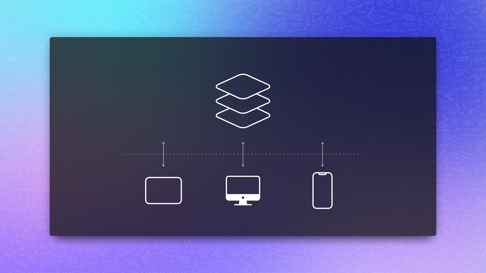

<div align="center">
  
  <h1>Local Storage</h1>
  <p>Simplified local storage API for any environment, <br/> if local storage is not supported, in-memory storage will be used as a fallback.</p>

  <p>
    <a href="https://github.com/alsolovyev/npm-packages/blob/master/LICENSE">
      
    </a>
    
  </p>
</div>



<br />

### Features

- support for devices without local storage
- automatic parsing of data upon receipt
- an optional default value as a fallback
- type safety

<br />

### Usage

```sh
npm install @alsolovyev/local-storage
```

```ts
// For CommonJS:
// const LocalStorage = require('@alsolovyev/local-storage').default
import LocalStorage from '@alsolovyev/local-storage'

interface IUser {
  _id: number
  name: string
  email: string
}

const localStorage = new LocalStorage()
const USER_KEY = 'user'
const user: IUser = {
  _id: 0,
  name: 'Jane Rivas',
  email: 'solovuev.a@icloud.com'
}

localStorage.set(USER_KEY, user)
localStorage.get<IUser | Pick<IUser, '_id'>>(USER_KEY, { _id: -1 })
localStorage.remove(USER_KEY)
```

<br />

### Interface

````ts
/**
 * The number of key/value pairs currently present in local storage.
 * @readonly
 */
get length(): number;

/**
 * Removes all key/value pairs from the store, if any.
 *
 * @returns true if removing was successful, otherwise false
 */
clear(): boolean;

/**
 * Returns the current value associated with the given key.
 * If the given key does not existin the list associated with the object,
 * then it returns the default value or null.
 *
 * @remarks
 * The return value is automatically parsed using JSON.parse()
 *
 * @param key - the key to look up the value in local storage
 * @param [defaultValue] - the fallback value
 * @returns the current value associated with the given key, or null
 *
 * @example Basic example:
 * ```ts
 * const localStorage = new LocalStorage()
 * localStorage.get<string>('key')
 * ```
 *
 * @example Default value example:
 * ```ts
 * const localStorage = new LocalStorage()
 * localStorage.get<string>('key', 'default value')
 * ```
 */
get<T>(key: string): T | null;
get<T>(key: string, defaultValue: T): T;
get<T>(key: string, defaultValue?: T): T | null;

/**
 * Removes the key/value pair with the given key from the list associated
 * with the object, if a key/value pair with the given key exists.
 *
 * @param key - the key to be removed from local storage
 * @returns true if the key/value has been removed, otherwise false
 */
remove(key: string): boolean;

/**
 * Sets the value of the pair identified by key to value, creating
 * a new key/value pair if none existed for key previously.
 *
 * @remark
 * The value will be converted to a string using JSON.stringify() before being stored
 *
 * @param key - the key by which a value will be stored in local storage
 * @param value - the value to be stored
 *
 * @returns true if the key/value has been saved, otherwise false
 */
set<T>(key: string, value: T): boolean;
````

<br/>

### References

- [Window.localStorage - Web APIs | MDN](https://developer.mozilla.org/en-US/docs/Web/API/Window/localStorage)

<br/>

### Authors

- **[Aleksey Solovyev](https://github.com/alsolovyev)** - [solovyev.a@icloud.com](mailto:solovyev.a@icloud.com)

<br/>

### License

This project is licensed under the [MIT](https://github.com/alsolovyev/npm-packages/blob/master/LICENSE) License
